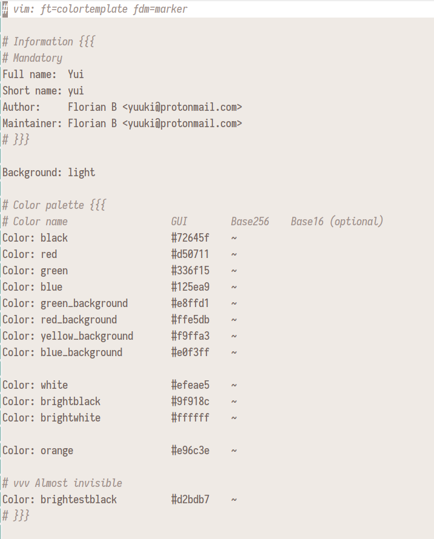
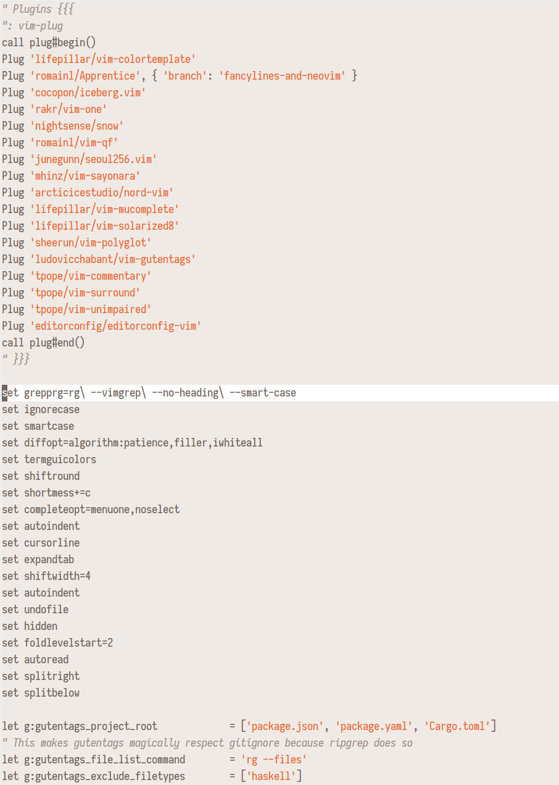
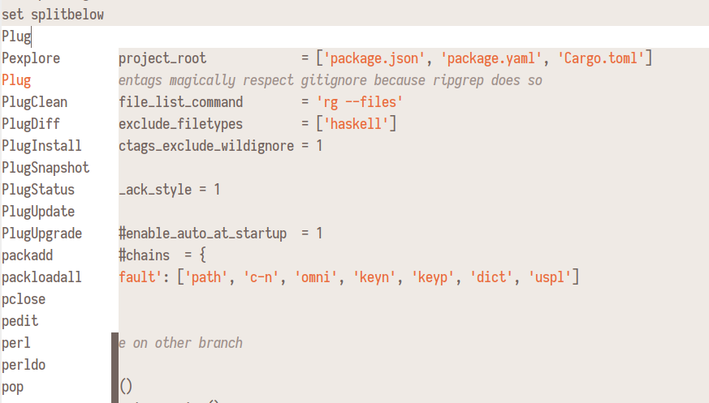
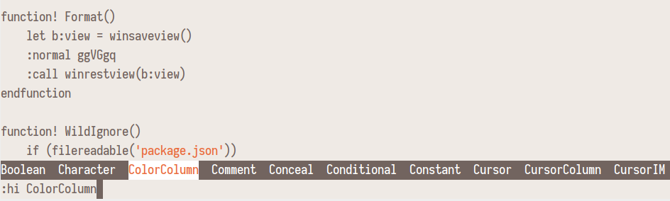
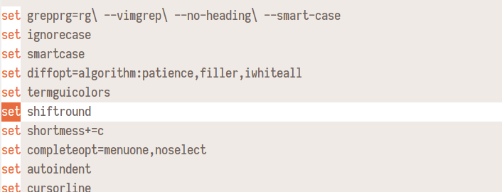

# Yui

Yui is a minimalistic theme using only a single color apart from red, green, yellow and blue for `diff`.

- Strings are orange
- Types are italic
- Folded text is almost invisible
- Comments are italic with low contrast

Built with [vim-colortemplate](https://github.com/lifepillar/vim-colortemplate)

