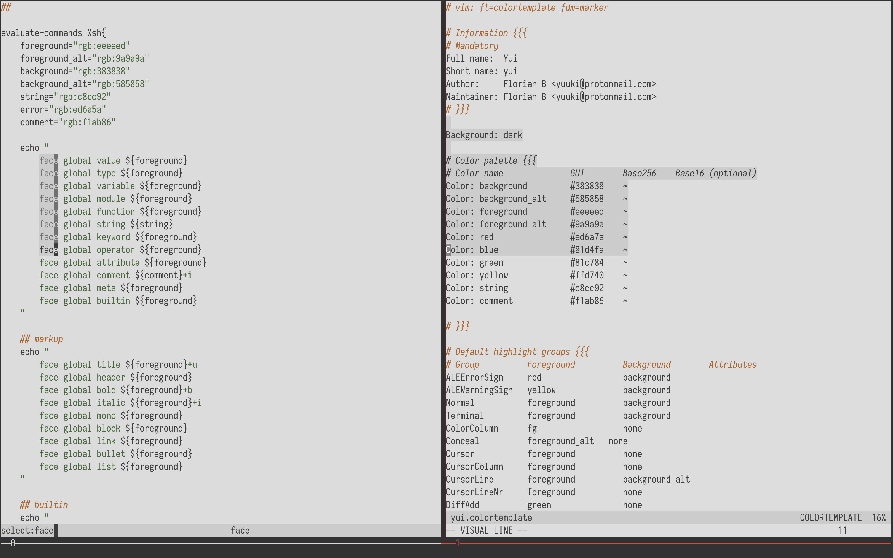

# Yui

Yui is a minimalistic theme using just three colors: green for strings, orange for comments and red for errors. Additionally, the `neovim` variant also has yellow and blue for `diff` colorization. It comes in both a dark and a light version and supports `vim`, `neovim` and `kakoune`.

The colors are taken from one of my favorite themes, [seoul256](https://github.com/junegunn/seoul256.vim).

The `neovim` colorthemes were built with [vim-colortemplate](https://github.com/lifepillar/vim-colortemplate)

