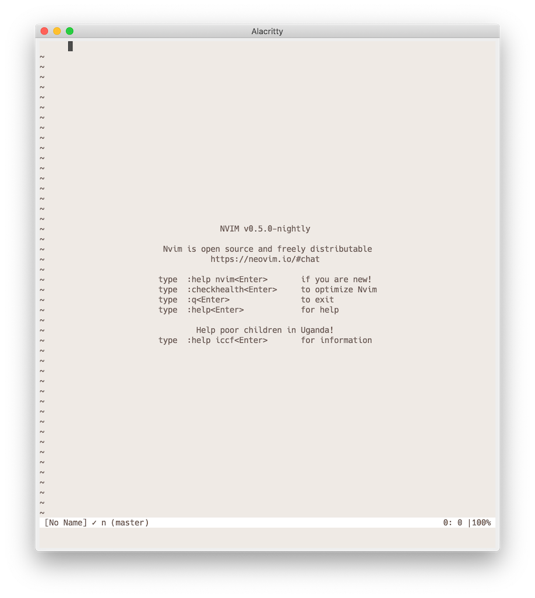
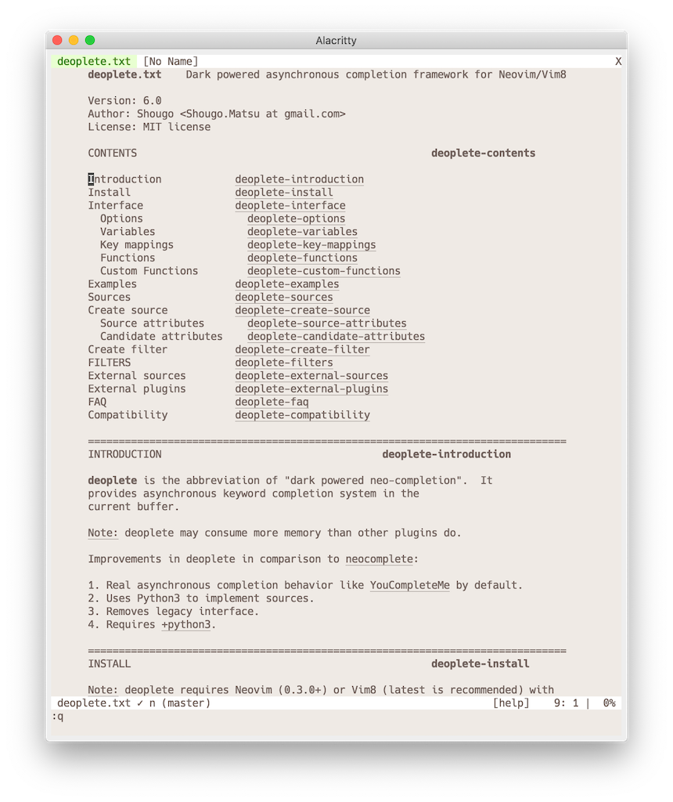
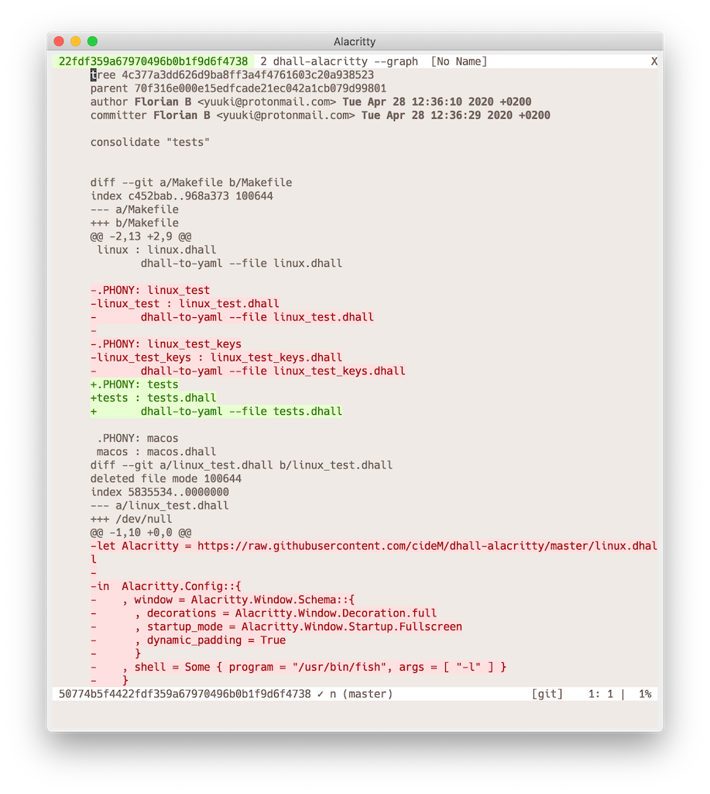
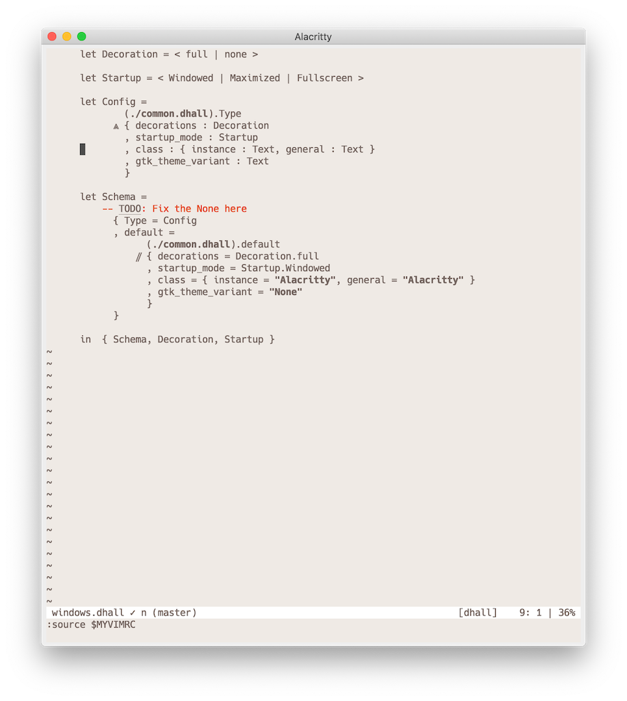
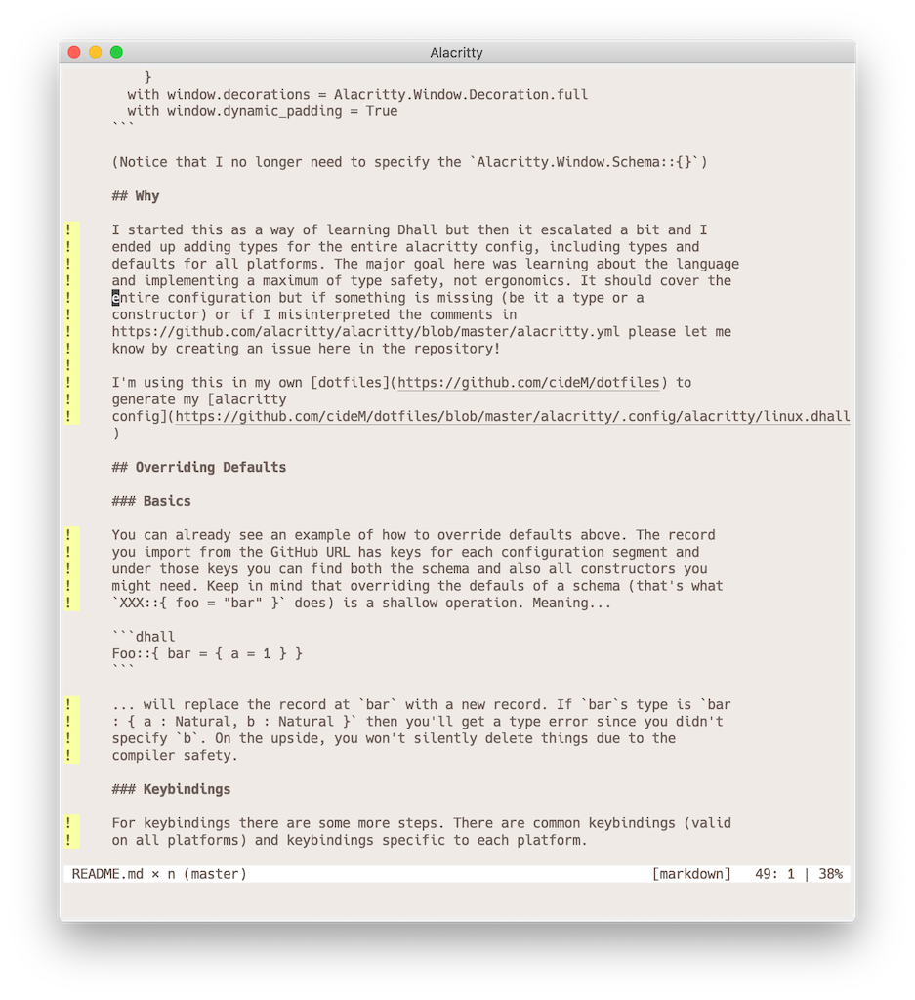
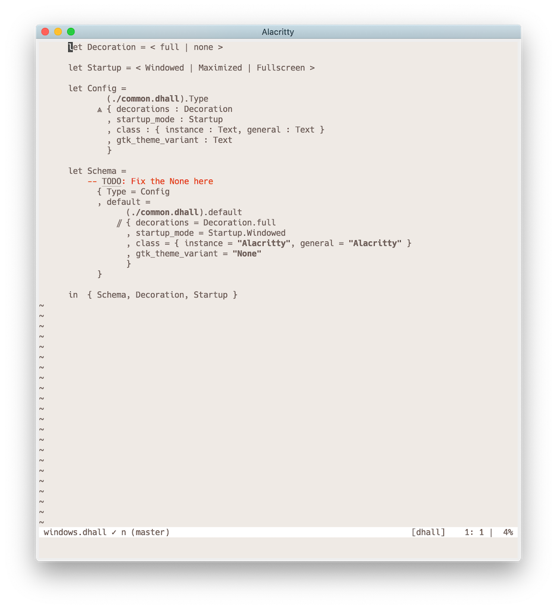
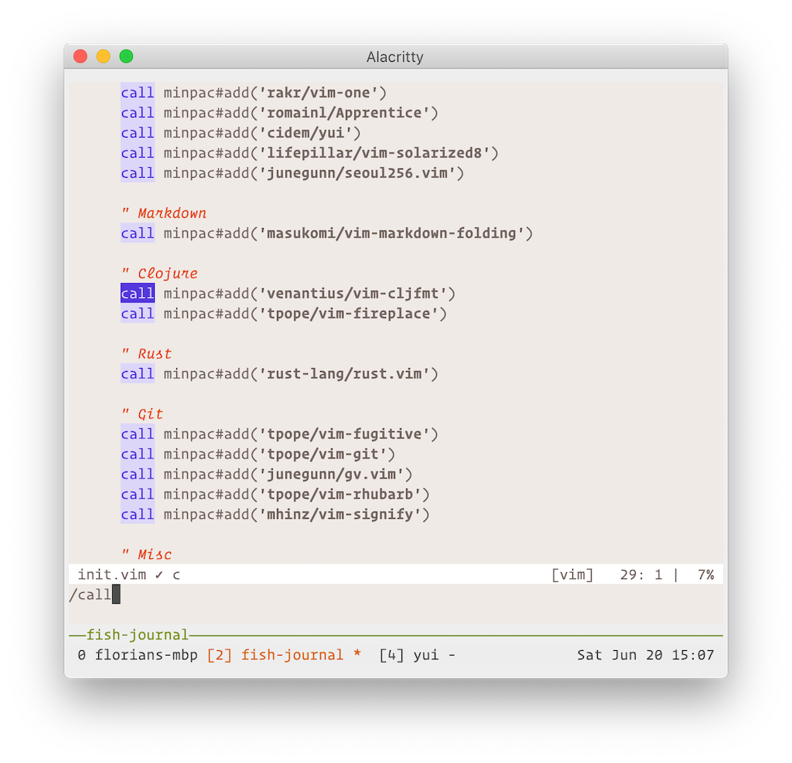

# YUI

## Intro

Experimental color scheme without any colors, except what's required to display a meaningful `diff`.
All syntax differentiation is achieved through font styles, so your terminal needs to support bold and italic text.

Shades are used for things like dimming folded text.

## Options

This information can also be found in the help, `:help yui`

### `g:yui_folds`

- `fade` (**default**): makes folded text less visible
- `emphasize`: gives folded text a distinct background color

### `g:yui_line_numbers`

- `fade` (**default**): makes line numbers and signcolumn text less visible
- `emphasize`: gives line numbers and signcolumn text a distinct background color

### `g:yui_comments`

`g:yui_emphasized_comments` takes precedence for backwards compatibility

- `fade`: makes comments less visible
- `emphasize`: makes comments more visible and is equivalent to `yui_emphasized_comments = 1`
- `normal` (**default**): does not affect comment visibility
- `bg`: make comments stand out by giving them a background. Text is not italic.

### `g:yui_emphasized_comments`

**DEPRECATED**: Use `g:yui_comments` instead

- `1`: comments are orange
- `0` (**default**): comments are faded, as before

## Changelog

- 0.21: Force LSP popup background to NONE
- 0.20: Add LspDiagnosticsDefaultHint and LspDiagnosticsDefaultInformation
- 0.19: Start adding some XML groups
- 0.18: Overhaul entire theme
		- Better contrast for Normal
		- Active StatusLine is now dark
		- Use purple for all selection things (Visual, Search, 
		  PMenu, WildMenu, TabLine)
		- Get rid of some duplicate but slightly different colors
		- Make MatchParen stand out more
		- Make sure all colors have a 256 color value
		- Add 'bg' option to comments
- 0.17: Remove Colortemplate
- 0.16: Add magenta and cyan and use for Term colors
- 0.15: Add signcolumn customization option
- 0.14: Add vim-dirvish colors
- 0.13: Adjust LspDiagnostics colors
- 0.12: Adjust WhichKeySeperator color so it's normal FG without bg
- 0.11: Add some WhichKey colors and fix typo in WhichKeySeperator
- 0.10: Add colors for neovim LSP
- 0.9:  Fix Cursor color which did not specify a background
        Add yui_folds option and overhaul folded text in general
- 0.8:  Add Whitespace and SpecialKey and link to LineNr
- 0.7:  Use Constant for helpCommand and helpBacktick (makes both bold) instead of
        defaulting to Comments
- 0.6:  Add purple background for search results (Search and IncSearch)
- 0.5:  Add `yui_comments` option

## Screenshots

