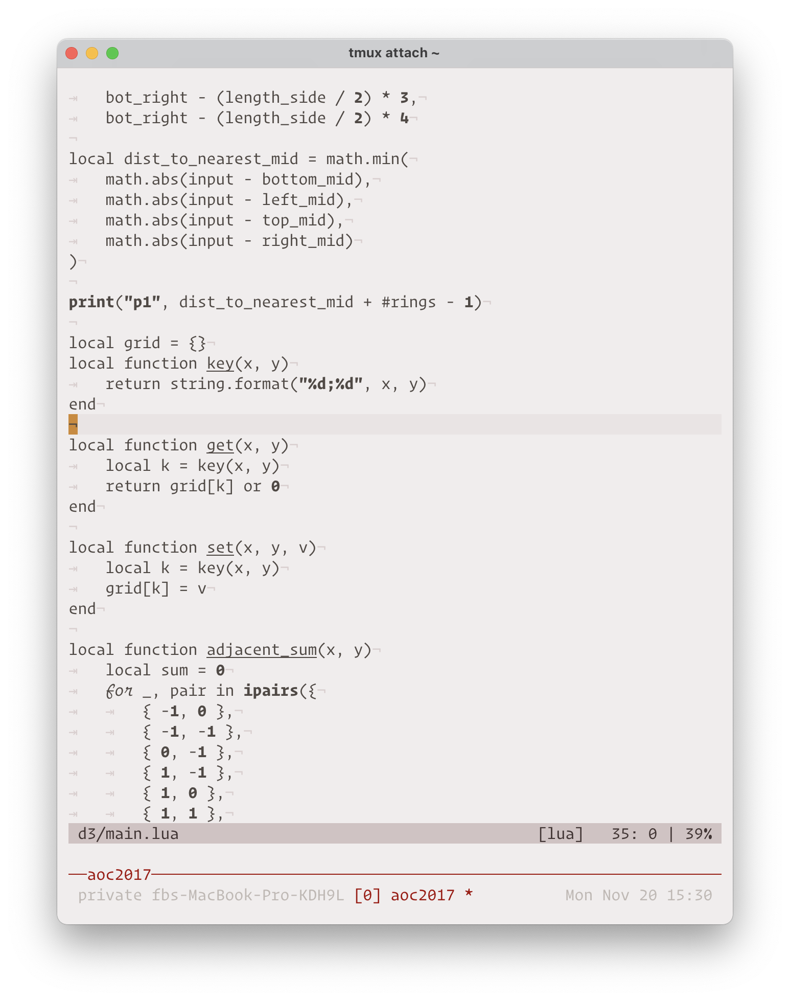
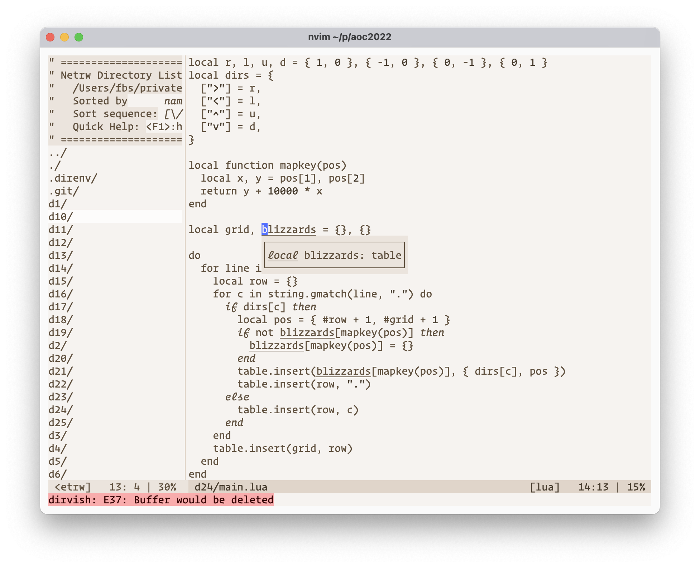
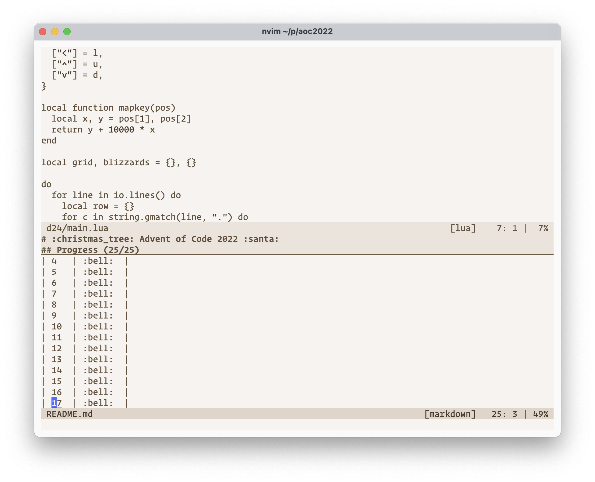
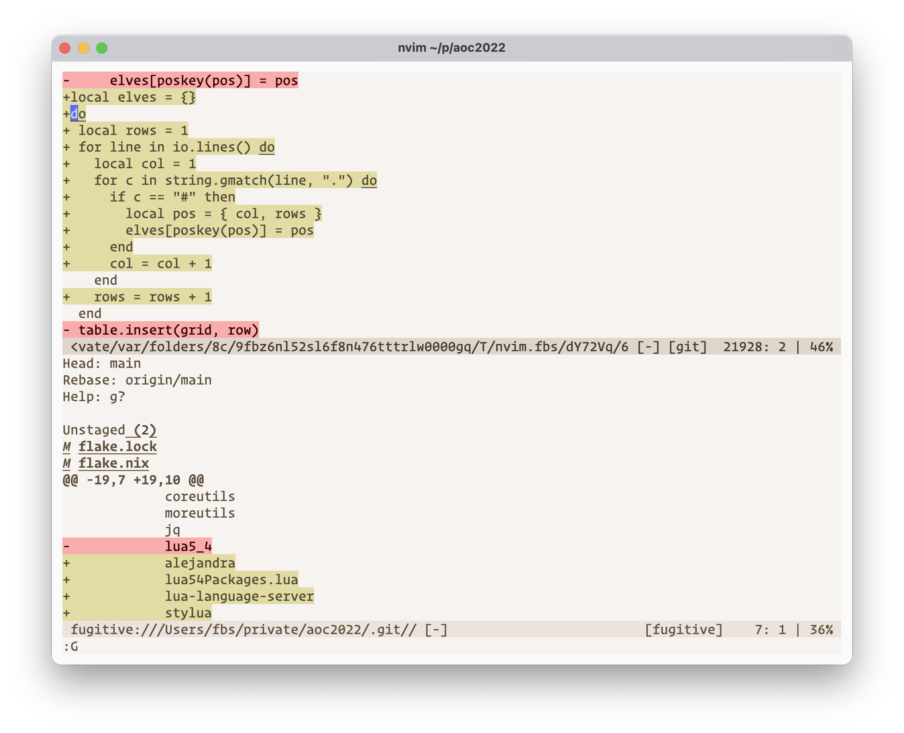
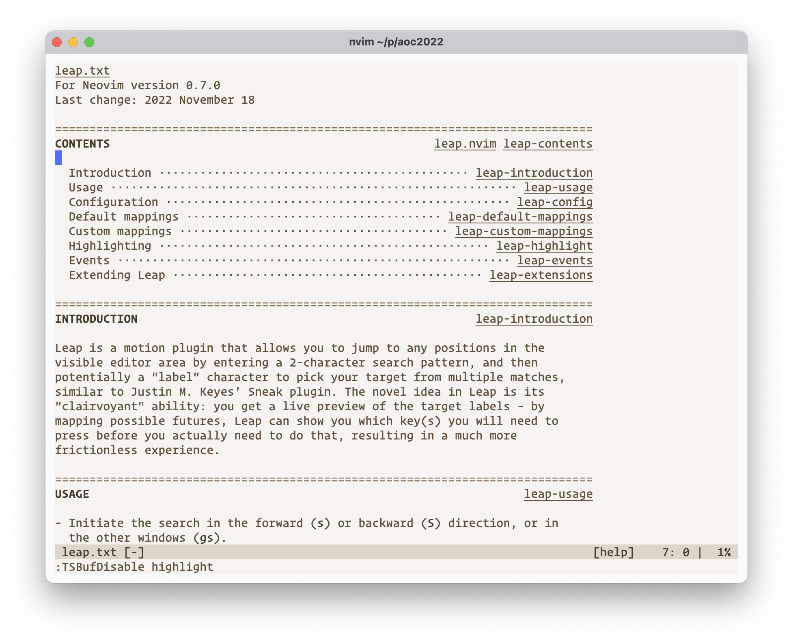
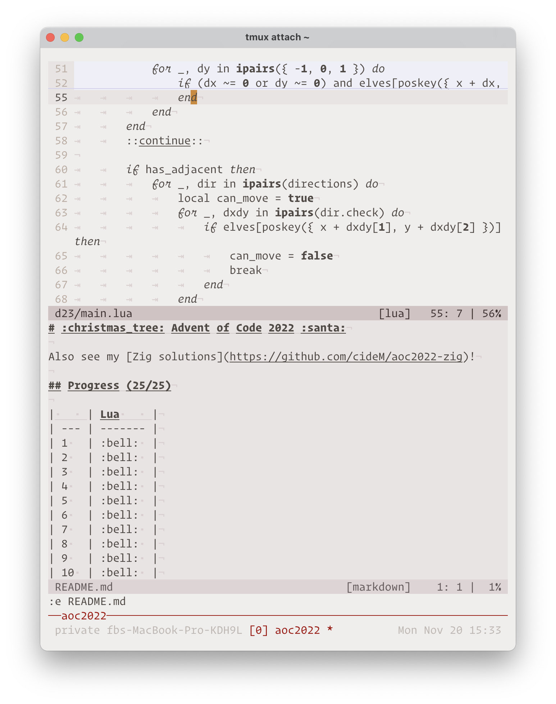

# YUI

A truly minimal color scheme inspired by the [Field Notes "Rams" Notebook](https://fieldnotesbrand.com/products/rams).

## Documentation

Please check [the documentation in the help text](./doc/yui.txt) with `:h yui.txt`

## Supported Plugins

- `nvim-hlslens`
- `lightline`
- `fugitive`
- `dirvish`
- `vim-sneak`
- `gitsigns`
- `conflict-marker.vim`
- `which-key`
- `leap`

## Contributing

Please see [CONTRIBUTING.md](./CONTRIBUTING.md)

## Screenshots

