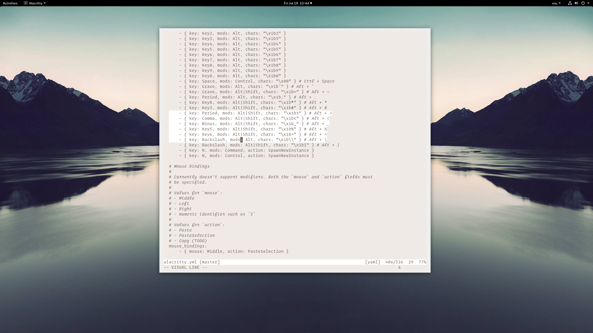
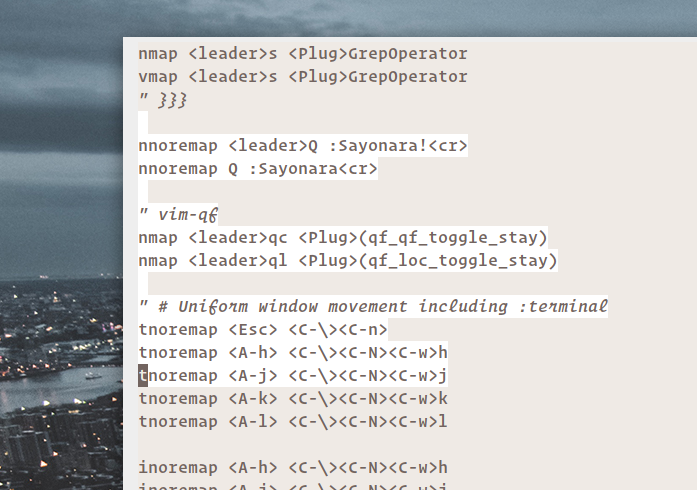
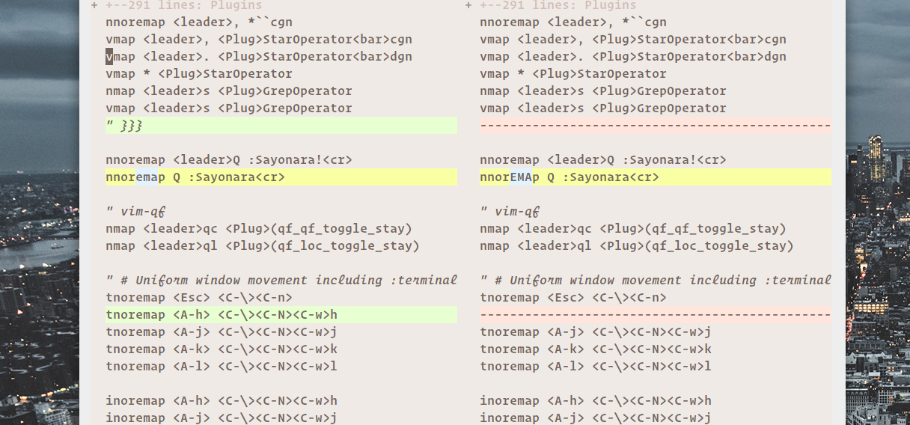
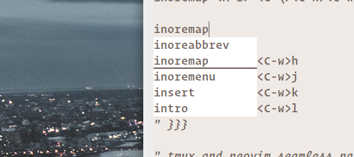
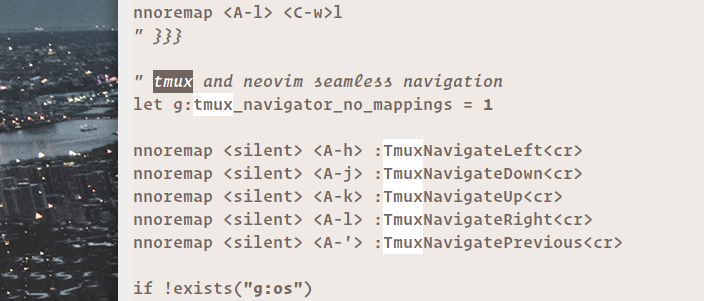

# Yui

Experimental color scheme without any colors, except what's required to display a meaningful `diff`.
All syntax differentiation is achieved through font styles, so your terminal needs to support bold and italic text.

Shades are used for things like dimming folded text.

