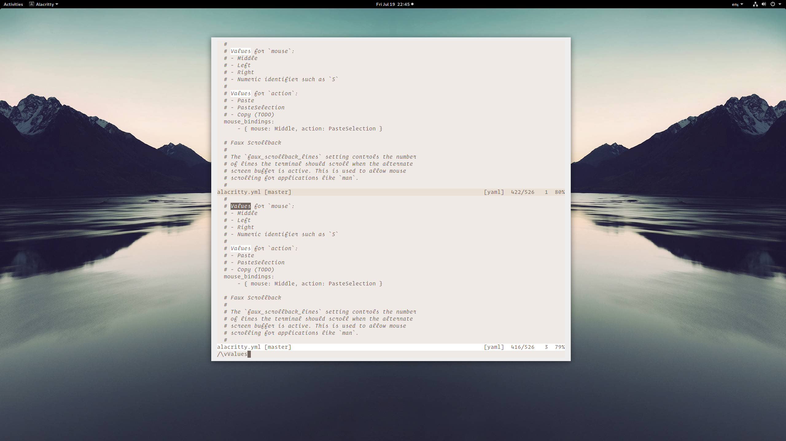
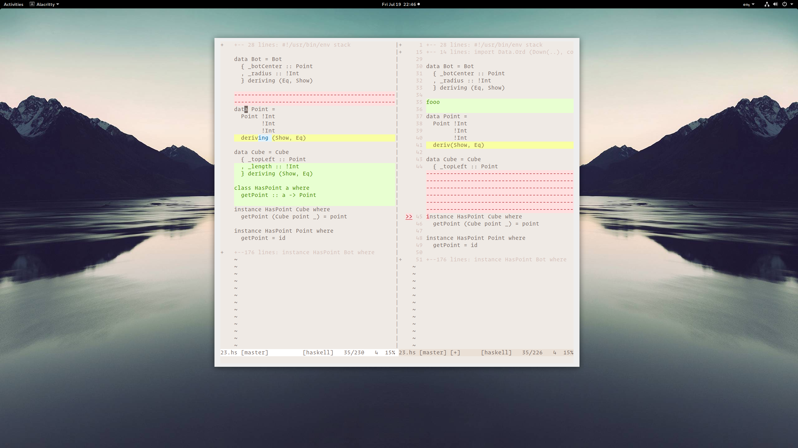
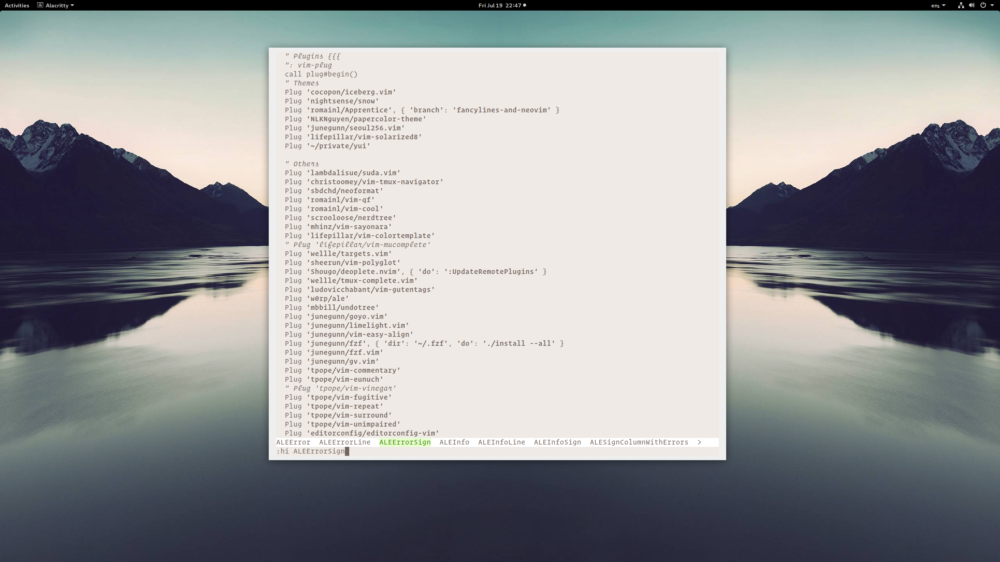
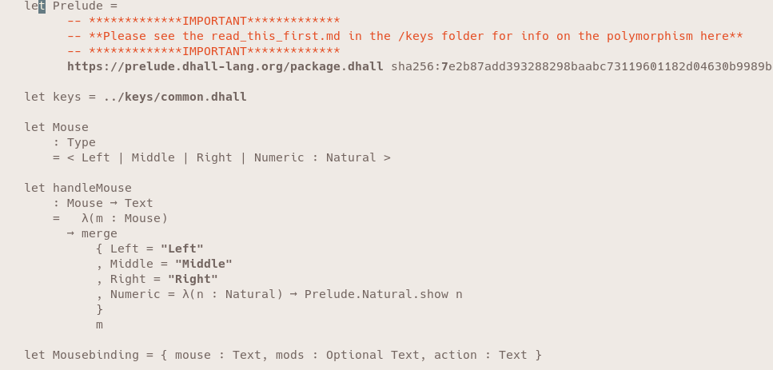

# Yui | ユイ

## Description

https://vim-yui.netlify.com/

Experimental color scheme without any colors, except what's required to display a meaningful `diff`.
All syntax differentiation is achieved through font styles, so your terminal needs to support bold and italic text.

Shades are used for things like dimming folded text.

## Options

* `yui_emphasized_comments`: when set to `1`, comments are orange, otherwise they are faded, as before. Defaults to `0`
    * Example: `let g:yui_emphasized_comments = 1`

## Something Looks Weird!

This is not yet a finished color scheme. If you spot any issues, please create an issue! Ideally you include an example file and/or screenshot.

## Screenshots

With `let g:yui_emphasized_comments = 1`

