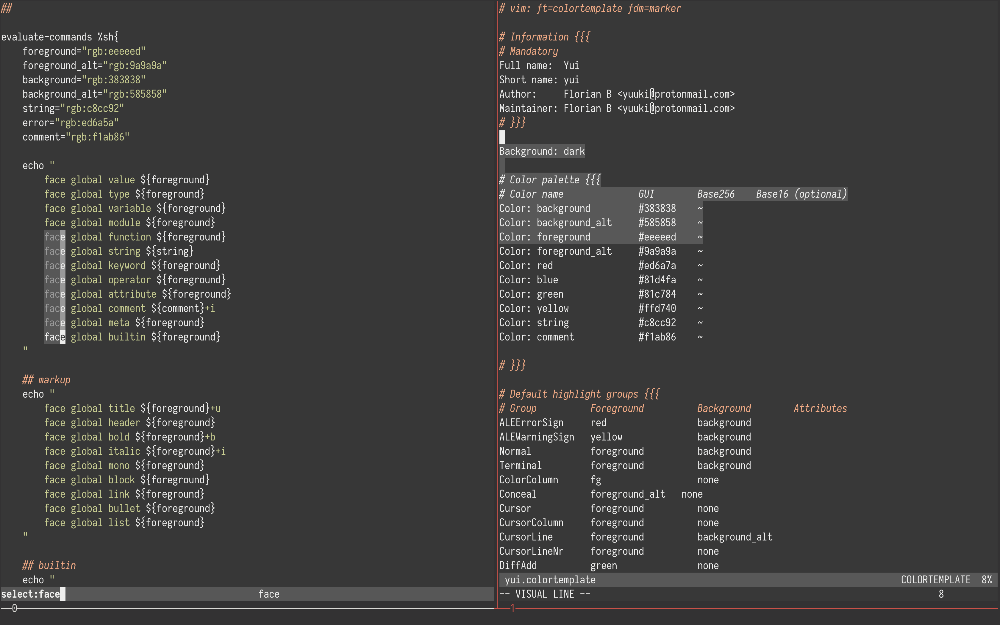

# Yui

Yui is a minimalistic theme using just three colors: red, green and yellow.
It's also usable with `f.lux` or `redshift` and supports diff coloring in
`neovim`.

The `neovim` colorthemes were built with [vim-colortemplate](https://github.com/lifepillar/vim-colortemplate)

